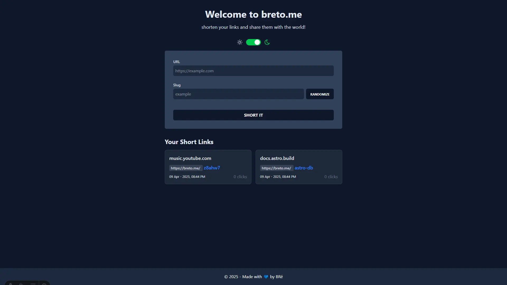

# Astro Starter Kit: Basics

This project uses Astro to create fast and modern web applications. Below, you'll find details on what this project does, how to set it up, and how to contribute.

## 🌟 What This Project Does

This starter kit is designed to help developers quickly build performant and scalable web applications using Astro. It includes a basic project structure, pre-configured commands, and a simple example to get you started.

### Features

- **Fast Development**: Leverage Astro's optimized build process for blazing-fast performance.
- **Modern Web Standards**: Build with modern tools and frameworks.
- **Customizable**: Easily extend and adapt the project to your needs.

## 🖼️ Project Preview



> Replace the above image with a screenshot of your project.

## 🚀 Getting Started

### Installation

1. Clone this repository to your local machine.
2. Install the required dependencies by running the following command in the project root:

   ```sh
   pnpm install
   ```

### Available Commands

| Command               | Action                                            |
| :-------------------- | :------------------------------------------------ |
| `pnpm dev`            | Starts the development server at `localhost:4321` |
| `pnpm build --remote` | Builds the production site to `./dist/`           |
| `pnpm preview`        | Previews the built site locally                   |
| `pnpm lint`           | Lints the project files using ESLint              |

### Project Structure

The project is organized as follows:

```text
/
├── public/
│   └── favicon.svg
├── src/
│   ├── layouts/
│   │   └── Layout.astro
│   └── pages/
│       └── index.astro
└── package.json
```

For more details on Astro project structure, check out [the official guide](https://docs.astro.build/en/basics/project-structure/).

## 🤝 Contributions

Contributions are welcome! If you'd like to collaborate, follow these steps:

1. Fork this repository.
2. Create a branch for your feature or bug fix:

   ```sh
   git checkout -b feature/new-feature
   ```

3. Make your changes and commit them:

   ```sh
   git commit -m "Add new feature"
   ```

4. Push your changes to your forked repository:

   ```sh
   git push origin feature/new-feature
   ```

5. Open a Pull Request (PR) in this repository describing your changes.

## 📚 Additional Resources

- Official Astro Documentation: [docs.astro.build](https://docs.astro.build)

Thank you for contributing and being part of this project!
